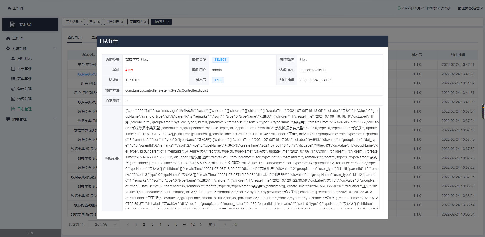

## 简介

TANSCI 基于 SpringBoot + Vue3.2 + Element Plus 的后台管理系统

基础模块：菜单管理、角色管理、组织管理、用户管理、字典管理、日志管理（操作日志、异常日志）

此项目分为微服务版和单体版：

微服务版：
- Gitee: [https://gitee.com/typ1805/tansci-cloud](https://gitee.com/typ1805/tansci-cloud)
- GitHub：[https://github.com/typ1805/tansci-cloud](https://github.com/typ1805/tansci-cloud)

 [演示地址](http://tansci.top:18002/)

## 架构

### 技术栈

#### 1、环境要求

| 名称 | 版本号 | 描述 |
| ---- | ---- | ---- |
| JDK | 1.8+ | 强制要求 |
| mysql | 5.7+ | 数据库 |
| node | 14.16+ | 前端环境要求 |
| npm | 6.14+ | 前端框架包管理 |
| Nginx | 1.16+ | 请求转发、反向代理 |
| Maven | 3.8+ | 项目构建，管理 |
| Git | 2.14+ | 项目版本管理 |

#### 2、后端技术

| 名称 | 版本号 | 描述 |
| ---- | ---- | ---- |
| SpringBoot | 2.6.1 | 整体架构基础 |
| Mybatis Plus | 3.4.3.1 | 数据层 |
| Druid | 1.2.6 | 连接池 |
| Spring Security | -- | 权限认证 |
| Fastjson | 1.2.75 | -- |
| JJWT | 0.9.0 | 安全认证 |
| knife4j | 3.0.3 | API 文档 |
| Lombok | -- | -- |

#### 3、前端技术

| 名称 | 版本号 | 描述 |
| ---- | ---- | ---- |
| vue | 3.2.16 | 整体架构基础 |
| element-plus | 1.2.0-beta.6 | UI |
| vue-router | 4.0.12 | 路由 |
| vuex | 4.0.2 | 状态管理模式 |
| vue3-echarts | 1.0.3 | echarts图表 |
| axios | 0.24.0 | 基于promise的HTTP库 |
| nprogress | 0.2.0 | -- |
| less | 4.1.2 | -- |

### 项目结构

<pre>
├─docs                         # 文档相关
├─sql                          # 数据库SQL脚本
├─src                          # 后端项目目录
│  ├─main
│  │  ├─java
│  │  │  └─com
│  │  │      └─tansci
│  │  │          ├─common       # 公共包
│  │  │          ├─config       # 配置
│  │  │          ├─controller   # controller 层
│  │  │          ├─domain       # 映射实体
│  │  │          │  ├─dto       # DTO 实体
│  │  │          │  └─vo        # VO 实体
│  │  │          ├─mapper       # mapper 层
│  │  │          ├─security     # 安全认证相关
│  │  │          ├─service      # service 层
│  │  │          │  └─impl
│  │  │          └─utils        # 工具包
│  │  └─resources
│  │      └─mapper              # mapper XML 映射
│  └─test                       # 测试
└─tansci-view                   # 前端项目目录
    ├─public
    └─src
        ├─api                   # 服务AIP配置
        ├─assets                # 静态资源（包含 公共样式、图片）
        │  ├─css                
        │  └─image
        ├─components            # 公共组件
        ├─layout                # 整体布局
        ├─router                # 路由
        ├─store                 # axios 封装
        ├─utils                 # 工具包
        └─views                 # 功能模块
            └─system            # 基础功能模块
</pre>

## 集成功能

| 模块 | 功能 | 进度 | 描述 |
| ---- | ---- | ---- | ---- |
| 基础模块 | 菜单管理 角色管理 组织管理 用户管理 字典管理 日志管理（操作日志、异常日志） | 已完成 | 基础功能模块 |
| 消息通知 | 短信通知 邮件通知 | 已完成 | 多种消息通知 |
| 定时任务 | ... | 已完成 | 动态配置定时任务 |
| 三方登录 | ... | 已完成 | 微信授权登录 |
| 支付 | 微信、支付宝 | 开发中 | 接口开发完成 |

## 详细文档

执行SQL初始化数据，测试用户：`admin / admin123`

[项目详细文档](docs/doc.md)

## 开发者联系

1、QQ：742354529

2、QQ群：747200630

3、微信群：加扣扣或关注公众号进

4、个人主站：[https://typ1805.gitee.io](https://typ1805.gitee.io)

5、个人公众号：

## 项目预览

